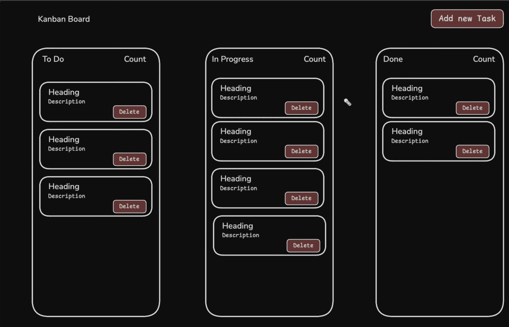

# Kanban Board

A clean and responsive **Kanban Board** built using **HTML, CSS, and JavaScript**.  
It allows users to create tasks, drag and drop them across workflow stages, delete tasks, and automatically saves everything using **localStorage**.

---

## 📌 Preview

---

## 🚀 Features

- ➕ **Add New Tasks** using a popup modal (Title + Description)  
- ↔️ **Drag & Drop** tasks between stages:
  - **To Do**
  - **In Progress**
  - **Done**
- 🗑️ **Delete Tasks**
- 🔢 **Task Counters** for each column  
- 💾 **localStorage Persistence**
- 📱 **Fully Responsive UI**

---

